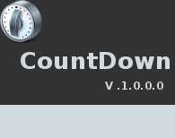

# CountDown
- How to construct a Timer that counts down from a certain number to indicate the beginning or end of an Event.

 

 

# Features  
- Communication with DLL using Broadcast.
- Handling Multi Threaded Event.

## Files

| File | Contents | 
| --- | --- |
| .gitignore | Git ignores the files in this file |
|uCountDown|  Main view of DLL|
| uOption.pas | Option view of DLL |
| uMain.pas | Main view of the APP |
|CountDownTimer1| Unit of the APP |
|CountDownTimer2| Unit of the APP |
|CountDownTimer3| Unit of the APP |
|CountDownTimer4| Unit of the APP |
| uAbout.pas | About view of the APP |
| CountDown.dpk | The compiler project file |
| CountDown.dproj | The MSBUILD project file |
| README.md | The readme for this project |

## To Install the Software:

### Install CountDown 
Download Link : https://github.com/walwalwalides/Delphi-Collection-VCL/releases/download/CountDown/CountDown.7z

