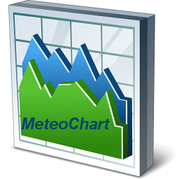

# MeteoChart
- Display As Many Graphics As Desired by the User with The Curves of
Temperature, Humidity and Atmospheric Pressure .                  
 

# Features  
 
- Implementation of the Observer Pattern To Deal with Decoupling Classes .
- View Current Temperature, Humidity and Pressure Using TChart Component .

## Files

| File | Contents | 
| --- | --- |
| .gitignore | Git ignores the files in this file |
| About.pas | About view of the programme |
| Main.pas | Main view of the programme |
| Chart.pas | Chart view of the programme |
| Logging.pas | Logging view of the programme |
| uMeteo.pas | uMeteo Unit |
| uObservable.pas | uObservable Unit |
| uInterfaces.pas | uInterfaces Unit |
| clConverter.dpk | The compiler project file |
| clConverter.dproj | The MSBUILD project file |
| README.md | The readme for this project |
