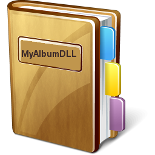

# MyAlbumDLL
- Load Image from a DLL resource.                   
 

# Features  
- Create And Edit Photo Albums. 
- Sorting Photos And Photo Albums.  

## Files

| File | Contents | 
| --- | --- |
| .gitignore | Git ignores the files in this file |
| uAbout.pas | About view of the programme |
| uMain.pas | Main view of the programme |
| MyAlbumDLL.dpk | The compiler project file |
| MyAlbumDLL.dproj | The MSBUILD project file |
| README.md | The readme for this project |
