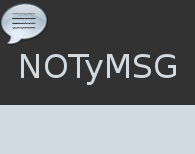

# NOTyMSG
- How to create a custom notification in windows     
 

## Built With
-Using only standard component

# Features  

- Communication between 2 windows from application
- Adding or modifying CSS styles,to change the look 

# Licence
Copyright (C) 2019-2020, walwalwalides (walwalwalides@gmail.com)          
                                                                         
This software is provided 'as-is', without any express or implied          
warranty. In no event will the authors be held liable for any damages      
arising from the use of this software.                                     
                                                                         
Permission is granted to anyone to use this software for any purpose,     
including commercial applications, and to alter it and redistribute it    
freely, subject to the following restrictions:                            

1. The origin of this software must not be misrepresented; you must not    
   claim that you wrote the original software. If you use this software    
   in a product, an acknowledgement in the product documentation would be  
   appreciated but is not required.                                        
2. Altered source versions must be plainly marked as such, and must not be 
   misrepresented as being the original software.                          
3. This notice may not be removed or altered from any source distribution.

## Files

| File | Contents | 
| --- | --- |
| .gitignore | Git ignores the files in this file |
| MainRecieve.pas | Main Reciever of the programme |
| MainSender.pas | Main Sender of the programme |
| Uscript.pas | Unit script of the programme |
| uresApp.pas | Unit of resource string |
| NOTyMSG.dpk | The compiler project NOTyMSG|
| NOTyMSG.dproj | The MSBUILD project NOTyMSG|
| NOTySEND.dpk | The compiler project NOTyMSG|
| NOTySEND.dproj | The MSBUILD project NOTyMSG|
| README.md | The readme for this project |
