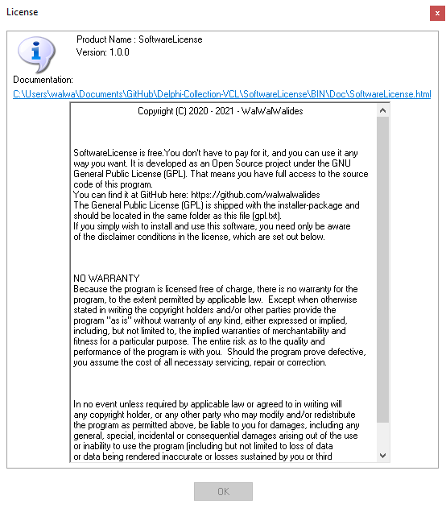

# SoftwareLicense 
SoftwareLicense is template end user license agreement.

**Authors:**  *WalWalWalides*
------

`SoftwareLicense` help to create user license agreement.

Principal Software Benefits:

     - Create a license agreement (html or scrollBox ) Foramt. 

### Main View

------

## Contains

| File | Contents | 
| --- | --- |
| .gitignore | Git ignores the files in this file |
| About.pas | About view of the programme |
| Main.pas | Main view of the programme |
| uExScrollbox.pas | ExScrollbox unit  |
| uToolLib.pas | ToolLib unit  |
| SoftwareLicense.dpk | The compiler project file |
| SoftwareLicense.dproj | The MSBUILD project file |
| README.md | The readme for this project |

------

# If You Want To Donate!

