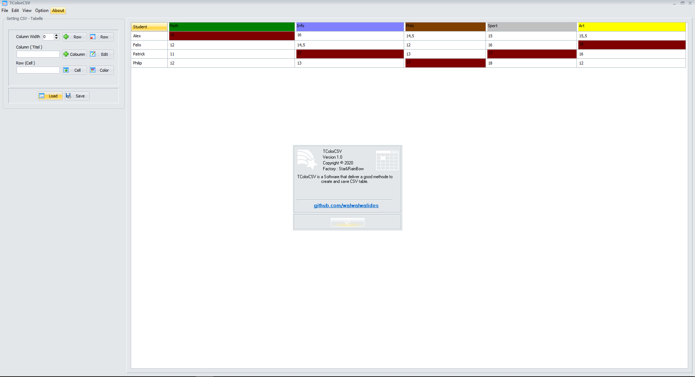

# TColorCSV 
TColorCSV is a Software that deliver a good methode to Create and Save CSV table.

**Authors:**  *WalWalWalides*
------

`TColorCSV` help to create easily CSV table.

Principal Software Benefits:

     - Reading and Writing CSV Files
     
     - Save the different parameters of Table (Color ,Width...)
     
     - PDF printer

### Main View

------

## Contains

| File | Contents | 
| --- | --- |
| .gitignore | Git ignores the Files in this File |
|[TColorCSV.exe](https://github.com/walwalwalides/TColorCSV/releases/download/TColorCSV/TColorCSV__Setup.exe)| Download TColorCSV
| README.md | The Readme for this Project|

------

# If You Want To Donate!

