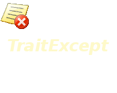

# TraitExcept
- How to Define Custom Exceptions in Delphi

 

# Features  
- Define error exception.
- Save error message.

## Files

| File | Contents | 
| --- | --- |
| .gitignore | Git ignores the files in this file |
| uAbout.pas | About view of the programme |
| uBase.pas | Base view of the programme |
| uMain.pas | Main view of the programme |
| uSignal.pas | Notification Thread unit  |
| TraitExcept.dpk | The compiler project file |
| TraitExcept.dproj | The MSBUILD project file |
| README.md | The readme for this project |

------

## To Install the Software:

### Install TraitExcept 
Download Link : https://github.com/walwalwalides/Delphi-Collection-VCL/releases/tag/TraitExcept
