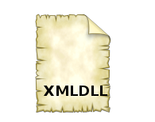

# XMLDLL
- Relite Main Application with DLL using XML files.

 

## Built With

* [jvcl Library](https://github.com/project-jedi/jvcl) - jvcl Library

# Features  

- Generate XML File and Bind a DLL to the Main Application.
- Managing Data Exchange and Parsing XML Files.
- Define a class to represent a Xml File in the Programme.

## Files

| File | Contents | 
| --- | --- |
| .gitignore | Git ignores the files in this file |
| Main.pas | main view of the programme |
| About.pas | About view of the programme |
| LogUser.pas | LogUser view of the programme |
| AccessUser.pas | AccessUser view of the programme |
| NewUser.pas | NewUser view of the programme |
| Configuration.pas |Configuration Unit | 
| MainSkinRect.pas |MainSkinRect Unit | 
| Skins.pas |Skins Unit |
| ButtonEventList.pas|ButtonEventList Unit | 
| SkinBase.pas| SkinBase Unit |
| pluginlist.pas |pluginlist Unit |
| XmlFileSettings.pas |XmlFileSettings Unit | 
| UtilsFunc.pas |UtilsFunc Unit |
| XmlFileHome.pas |XmlFileHome Unit |
| ResImg.pas |ResImg Unit |
| ResXml.pas| ResXml Unit |
| XMLDLL.dpk | The compiler project file |
| XMLDLL.dproj | The MSBUILD project file |
| MainHome.pas | Main View of DLL |
| Home.dproj | The MSBUILD DLL project|
| README.md | The readme for this project |

